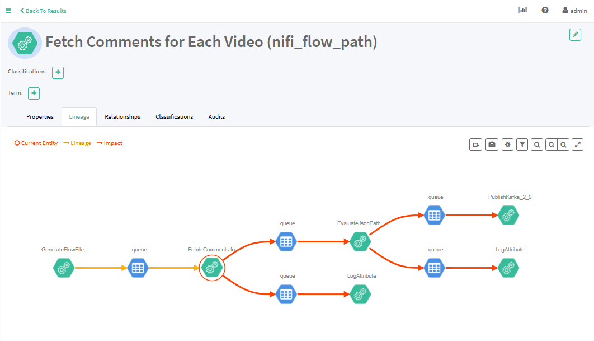

# Sentilytics : 


**Data Governance and Metadata Management in a Data Pipeline Using Apache Atlas within a Lambda Architecture**


## Project Pipeline


## 📄 DESCRIPTION

This project focuses on designing and implementing a comprehensive big data pipeline that adheres to the principles of Lambda Architecture, ensuring real-time and batch processing capabilities while maintaining robust data governance and metadata management using Apache Atlas.  

#### **Project Overview**  
1. **Data Sources:**  
   - **YouTube API:** Streams video-related data, enabling analysis of trends and public sentiment in media content.  
   - **New York Times API:** Streams news articles and metadata, offering insights into public sentiment across various topics.  

2. **Sentiment Analysis Model:**  
   - A financial sentiment analysis model is trained using a labeled dataset from Kaggle: [Financial Sentiment Analysis](https://www.kaggle.com/datasets/sbhatti/financial-sentiment-analysis).  
   - The trained model is applied to streaming and batch data to analyze sentiments expressed in the incoming text from the two data sources.  

3. **Lambda Architecture Implementation:**  
   - **Batch Layer:**  
     - **Apache Spark:** Handles large-scale data processing for historical data analysis.  
     - **Apache Hive:** Stores processed, structured data and acts as a central data warehouse.  
     - **Spark ML:** Supports the training of the sentiment analysis model.  
   - **Speed Layer:**  
     - **Spark Streaming:** Processes streaming data in real-time from the YouTube and New York Times APIs.  
     - **Apache NiFi:** Facilitates data validation, transformation, and the merging of data streams from both sources, ensuring data quality and consistency.
      - **mongodb**: For storing processed data from sprak streaming 
   - **Serving Layer:**  
     - **Apache Parquet:** Provides optimized storage for data views, enabling efficient querying.  
     - **Streamlit:** A visualization tool for monitoring and exploring the processed data in real-time.  
     - **Apache Zeppelin:** Supports advanced analytics and visualization for exploratory data analysis.  

4. **Data Governance and Lineage:**  
   - **Apache Atlas:** Ensures end-to-end governance and metadata management of the data pipeline. This includes tracking data lineage (e.g., origin, transformations, and usage) and providing visibility into the lifecycle of data as it flows through the pipeline.  

5. **Workflow Orchestration:**  
   - **Apache Airflow:** Orchestrates and automates the various tasks in the pipeline.  

#### **Key Outcomes:**  
- Real-time sentiment insights from streaming data sources.  
- Scalable and efficient batch processing for historical data.  
- Seamless integration of governance and metadata management to enhance traceability and compliance.  
- An interactive dashboard for data visualization and analysis.  

## Requirements
- Docker and Docker Compose
- Minimum 16GB RAM recommended
- [Make](https://gnuwin32.sourceforge.net/packages/make.htm)
- Python >= 3.10

## Installation

1. clone the project.

```bash
git clone https://github.com/mohamed2020m/Sentilytics
```

2. Run docker compose 

```bash
make start
```

## 🤖Model Training

1. Make sure that the Zipline service is running and exposed on port 8085. You can check this by verifying the container where Zipline is deployed.
2. To open the Zipline web interface, enter the following URL in the browser's address bar :
```bash
http://localhost:8085/ 
```
3. Import the SentimentAnalysis notebook located in the `models` folder.
4. Run the SentimentAnalysis notebook to explore the different steps we used for selecting the best classification model to use.
5. We use MLflow for tracking our machine learning models, which helps us compare different versions and evaluate their performance. MLflow enables us to track experiments by recording metrics, parameters, and output files for each run.

   To access the MLflow web UI and compare different metrics, use the following command:
```bash
mlflow ui -p 1234
```

## 🔑 Get Your keys

Please follow the detailed instructions in our report on how to obtain API keys from Google Cloud and The New York Times.

## Nifi & Kafka configuration

Create new topic `kafka-nifi-dst` using the following command:

```bash
make create_kafka_topic
```

Verify `kafka-nifi-dst` topic creation

```bash
make list_kafka_topic
```

**Note:** YOU HAVE TO UPDATE KAFKA PROCESSOR IN NIFI TO USE YOU'RE IP LOCAL. 

For more info check our article.

## ⚙️ Nifi & Atlas configuration

Add nifi-atlas NAR to nifi container

```bash
make add_atlas_to_nifi
```

## Test Nifi-Kafka communication

To test Nifi-kafka communication follow these steps:
1. Go to `tests` folder

2. run the following command:
```bash
make conf_test
```
This will copy the dummy json file `f914bab7-d46d-4c1d-b2c1-aa8c699958e` to the `nifi_container_persistent` container

3. Open apache nifi by visting `http://localhost:8091/nifi/` 

4. Add a new proccessor `GetFile` and configurate like this:

<p align="center">
   
</p>

5. Connect it to `PublishKafka_2_0` proccessor
like this: 

<p align="center">
   
</p>

6. Run the `kafka_consumer.py` script

7. Go back to nifi and start only these two proccesors

8. Finnaly, verify you're terminal you will see something like this:


## ⚙️ Data processing with sprak streaming

The steps :
- Step 1: Raw data consumption from kafka from apache Nifi
- Step 2: processing of this data (e.g., retrieving useful fields, filtering to keep only comments in English, etc.)
- Step 3: After these processes, the data is stored in the mongoDB database.

To start streaming jobs we will start by running apache spark :
1.	Open a shell inside the spark container (assumes the containers are up and running) :
```bash
docker compose exec spark bash
```
2. Cd into the /app directory which has the volume pointing to the same directory as the root of the repository
```bash
cd /app
```
3. Packages to install
```bash
pip install -r requirements1.txt
```
### Retrieval of raw data from kafka and their processing
As mentioned above we will consume raw data with various structures from kafka and these data will be transformed to be stored in the mongo database. To do this we will execute the following command:
```bash
spark-submit --packages org.apache.spark:spark-sql-kafka-0-10_2.11:2.4.5 --jars kafka-clients-2.2.0.jar --driver-class-path kafka-clients-2.2.0.jar stream_consumer.py
```
This stream_consumer file uses the utils file which contains the different processing functions

## Orchestration with Airflow
We used airflow to orchestrate the following part of our pipeline:

<p align="center">
   
</p>

First to access the airflow interface, head to http://localhost:8080/

***username :***             airflow
***password :***             airflow

<p align="center">
   
</p>

You will see a DAG named sentilytics_pipeline. Launch it, and it will execute every 10 seconds.

<p align="center">
   
</p>

This data processing pipeline involves three main tasks. First, we check for the presence of documents in MongoDB. If documents are found, we fetch 100 of them and perform inference to generate predictions on the new data retrieved from YouTube and The New York Times. Finally, we remove these 100 documents from MongoDB.


## Real-time Visualization using Streamlit

### Pre-installation

```bash
pip install -r requirements.txt
```
### Set-up

Create a file called .env and fill in the following content
```bash
HOST=localhost
PORT=10000
USER=hive
PASSWORD=your_password
DATABASE=Hive_database
```

### 📊 Stream the complex visualization
To perform streaming processing on the dashboard, you need to deploy all the settings mentioned above, as well as ensure that the entire pipeline is functioning correctly and all its components are in place.

### Run 
To start the visualization of historical data and real-time predictions, run the following command:

```bash
streamlit run app.py --server.port 8502
```

## 🎥 Video Demo

Watch our video demo here 👇
<p align="center">
   <a href="https://drive.google.com/file/d/13sxlESQgW1Z_gMACT10qyb2f2WIebrEa/view?usp=drive_link" target="_blank">
      
   </a>
</p>


## Apache Atlas

To set up Atlas hooks in Apache NiFi, follow our detailed guide. Once you've completed the setup, navigate to the Apache Atlas interface, where you should see components displayed as follows:

<p align="center">
   
</p>
