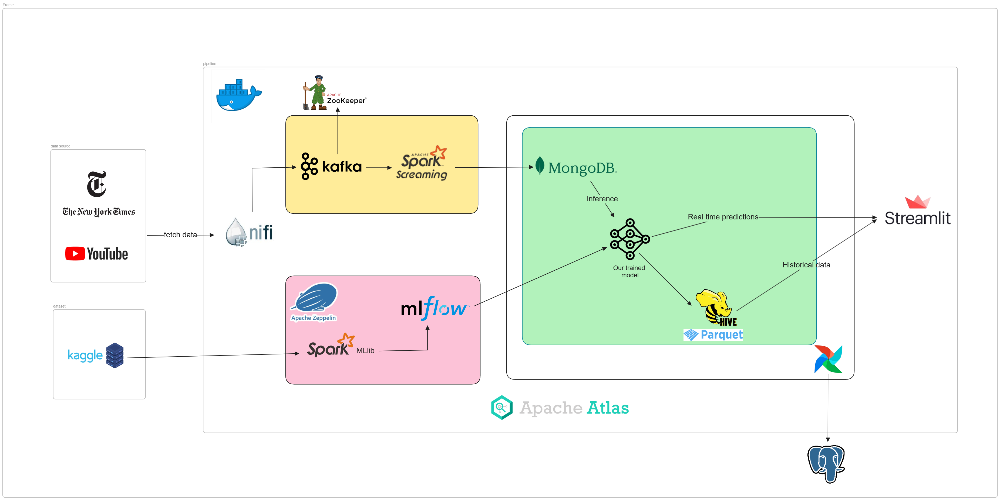

# Sentilytics

TODO: 

DESCRIPTION





## Installation

TODO:

## Nifi & Kafka configuration

Create new topic `kafka-nifi-dst` using the following command:

```bash
make create_kafka_topic
```

Verify `kafka-nifi-dst` topic creation

```bash
make list_kafka_topic
```

**Note:** YOU HAVE TO UPDATE KAFKA PROCESSOR IN NIFI TO USE YOU'RE IP LOCAL. 

For more info check our article.

## Nifi & Atlas configuration

Add nifi-atlas NAR to nifi container

```bash
make add_atlas_to_nifi
```

## Test Nifi-Kafka communication

To test Nifi-kafka communication follow these steps:
1. Go to `tests` folder

2. run the following command:
```bash
make conf_test
```
This will copy the dummy json file `f914bab7-d46d-4c1d-b2c1-aa8c699958e` to the `nifi_container_persistent` container

3. Open apache nifi by visting `http://localhost:8091/nifi/` 

4. Add a new proccessor `GetFile` and configurate like this:


5. Connect it to `PublishKafka_2_0` proccessor
like this: 


6. Run the `kafka_consumer.py` script

7. Go back to nifi and start only these two proccesors

8. Finnaly, verify you're terminal you will see something like this:


## Model Training


1. Make sure that the Zipline service is running and exposed on port 8085. You can check this by verifying the container where Zipline is deployed.
2. To open the Zipline web interface, enter the following URL in the browser's address bar :
```bash
http://localhost:8085/ 
```
3. Import the SentimentAnalysis notebook located in the `models` folder.
4. Run the SentimentAnalysis notebook to explore the different steps we used for selecting the best classification model to use.
5. We use MLflow for tracking our machine learning models, which helps us compare different versions and evaluate their performance. MLflow enables us to track experiments by recording metrics, parameters, and output files for each run.

   To access the MLflow web UI and compare different metrics, use the following command:
```bash
mlflow ui -p 1234
```


## Real-time Visualization using Streamlit

### Pre-installation

```bash
pip install -r requirements.txt
```
### Set-up

Create a file called .env and fill in the following content
```bash
HOST=localhost
PORT=10000
USER=hive
PASSWORD=your_password
DATABASE=Hive_database
```

### Stream the complex visualization
To perform streaming processing on the dashboard, you need to deploy all the settings mentioned above, as well as ensure that the entire pipeline is functioning correctly and all its components are in place.

### Run 
To start the visualization of historical data and real-time predictions, run the following command:

```bash
streamlit run app.py --server.port 8502
```


